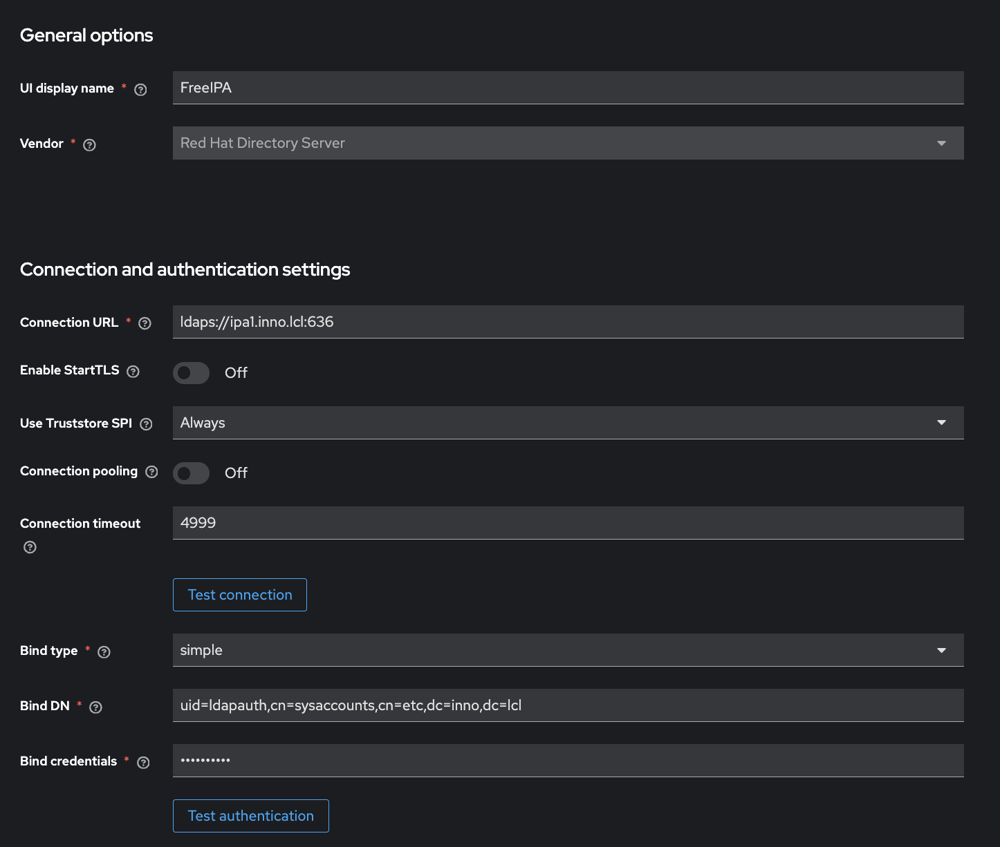
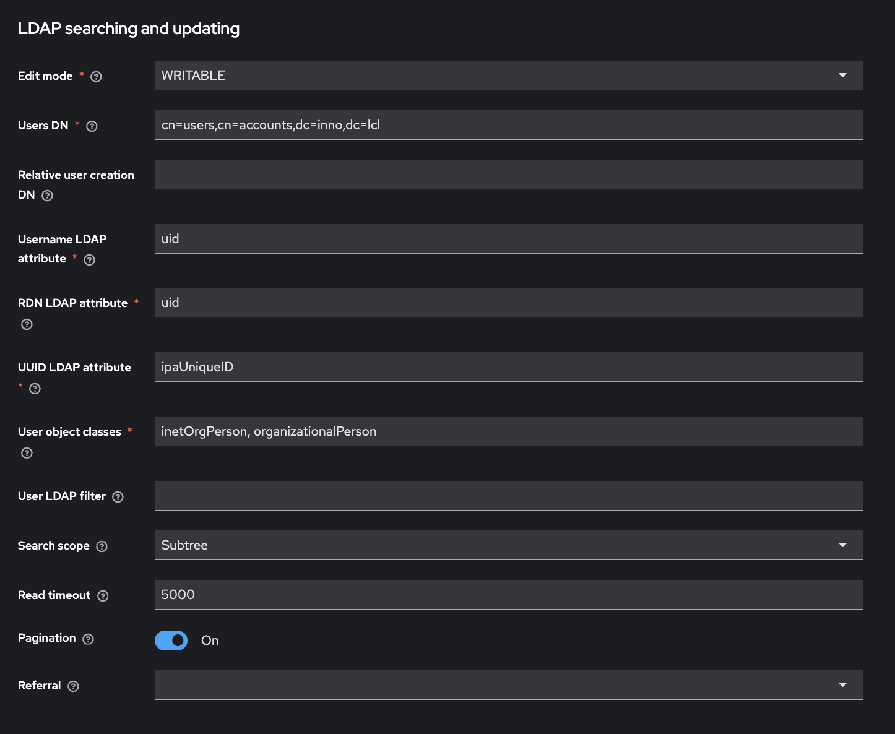
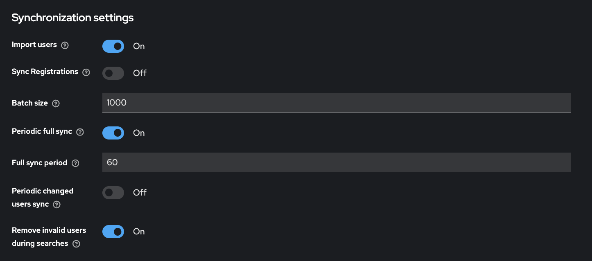
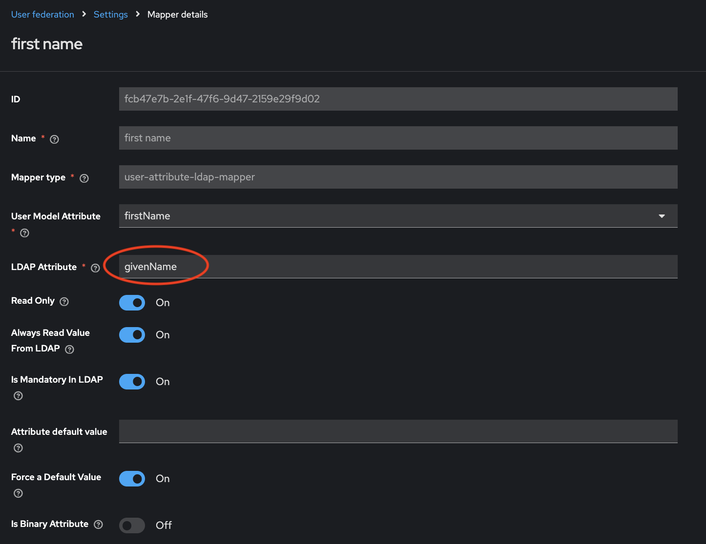
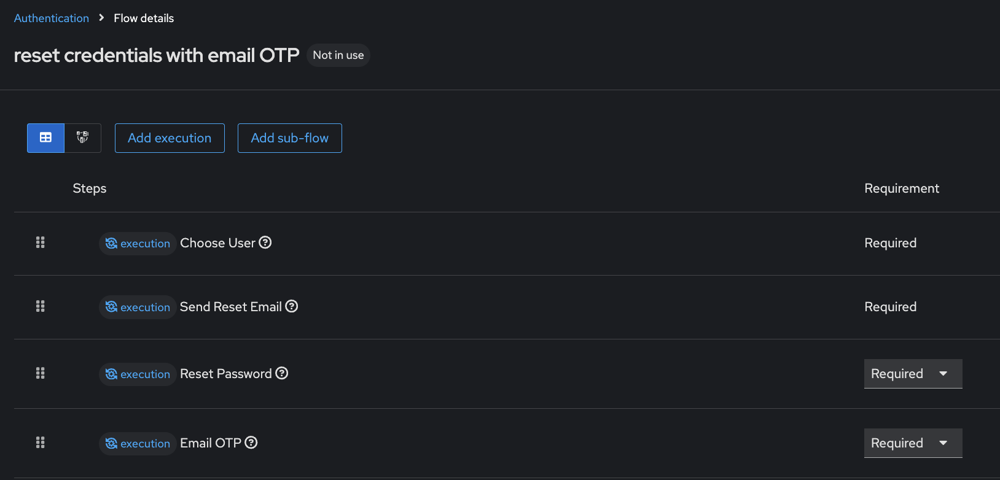

# Keycloak with FreeIPA Backend

Complete Identity and Access Management (IAM) solution with FreeIPA LDAP integration and Email OTP authentication.

## Architecture

- **Keycloak**: Identity and Access Management (IAM)
- **PostgreSQL**: Keycloak database backend
- **FreeIPA**: LDAP user directory (authentication backend)
- **Nginx Proxy Manager**: Reverse proxy with SSL termination
- **Email OTP Extension**: Custom authenticator for email-based 2FA

## Prerequisites

- Docker and Docker Compose installed
- FreeIPA server running and accessible
- SMTP server for email delivery
- Domain name configured
- FreeIPA CA certificate (automatically imported on startup)

## Features

- ✅ Secure LDAPS connection with FreeIPA CA certificate
- ✅ Automatic certificate import on container startup
- ✅ Email-based OTP for two-factor authentication
- ✅ User and group synchronization from FreeIPA
- ✅ SSL/TLS termination with Nginx Proxy Manager
- ✅ Persistent PostgreSQL database

## Quick Start

### 1. Configure Environment

Copy `.env.example` to `.env` and update the values:

```bash
cp .env.example .env
```

Edit `.env` with your configuration:
- Database credentials
- Keycloak admin credentials
- Hostname settings
- FreeIPA server details

### 2. Start Services

```bash
docker compose up -d
```

This starts:
- PostgreSQL database
- Keycloak server
- Nginx Proxy Manager

### 3. Initialize FreeIPA CA Certificate

Choose one of the following methods to import the FreeIPA CA certificate:

#### Option A: Pre-startup Initialization (Recommended)
Run before starting containers (no restart required):

```bash
./init-truststore.sh
docker compose up -d
```

#### Option B: Post-startup Setup
Start containers first, then run setup:

```bash
docker compose up -d
./init.sh
docker compose restart keycloak
```

Both scripts automatically detect the FreeIPA server from your `.env` file and import the CA certificate into Keycloak's truststore.

### 4. Verify Services

```bash
docker ps
```

Expected containers:
- `keycloak` - Keycloak IAM server
- `keycloak-postgres` - PostgreSQL database
- `nginx-proxy-manager` - Reverse proxy

### 5. Access Keycloak

- **Internal**: http://localhost:8080
- **External**: https://your-domain.com (after NPM configuration)
- **Admin credentials**: From `.env` file (`KEYCLOAK_ADMIN` / `KEYCLOAK_ADMIN_PASSWORD`)

**⚠️ IMPORTANT**: Change the admin password after first login!

## Configuration

### Realm Setup

1. Login to Keycloak Admin Console
2. Click the dropdown in the top-left (shows "master")
3. Click **"Create Realm"**
4. Configure:
   - **Realm name**: Your company/org name
   - **Enabled**: ON
5. Click **"Create"**

### Email Configuration (for OTP)

1. Go to **Realm settings** → **Email** tab
2. Configure SMTP:
   - **From**: noreply@example.com
   - **Host**: smtp.example.com
   - **Port**: 587
   - **Authentication**: Enabled
   - **Username**: your-smtp-username
   - **Password**: your-smtp-password
   - **Enable StartTLS**: Enabled
3. Click **"Save"**
4. Click **"Test connection"** to verify

### FreeIPA LDAP Integration

#### 1. Add LDAP Provider

1. Go to **User Federation**
2. Click **"Add provider"** → Select **"ldap"**

#### 2. Configure LDAP Settings

**General Settings:**
- **Console Display Name**: FreeIPA
- **Enabled**: ON
- **Vendor**: Red Hat Directory Server

**Connection and Authentication:**
- **Connection URL**: `ldaps://your-ipa-server:636` (for encrypted connection with certificate)
- **Bind Type**: simple
- **Bind DN**: `uid=ldapauth,cn=sysaccounts,cn=etc,dc=example,dc=com`
- **Bind Credential**: Your FreeIPA service account password

**Connection Settings:**
- **Use Truststore SPI**: `Always` or `ldapsOnly` (for encrypted LDAPS connection)
- **Connection Pooling**: ON
- **Connection Timeout**: 5000
- **Read Timeout**: 5000
- **StartTLS**: OFF (not needed when using ldaps://)

**Note on Encryption:**
- The setup includes automatic import of FreeIPA CA certificate into Keycloak's truststore
- Use `ldaps://` (port 636) for encrypted LDAP with connection pooling
- Do not enable StartTLS when using ldaps:// - they cannot be used together
- Alternative: Use `ldap://` (port 389) with StartTLS enabled (disables connection pooling)




**LDAP Searching and Updating:**
- **Edit Mode**: READ_ONLY (recommended) or WRITABLE for password reset
- **Users DN**: `cn=users,cn=accounts,dc=example,dc=com`
- **Username LDAP attribute**: `uid`
- **RDN LDAP attribute**: `uid`
- **UUID LDAP attribute**: `ipaUniqueID`
- **User Object Classes**: `inetOrgPerson, organizationalPerson`
- **Search Scope**: Subtree



**Synchronization Settings:**
- **Import Users**: ON 
- **Sync Registrations**: OFF (for READ_ONLY mode)
- **Periodic Full Sync**: ON (optional)
- **Full Sync Period**: 60000 (60 seconds)
- **Batch Size**: 1000



#### 3. Save and Test

1. Click **"Save"**
2. Click **"Test connection"** → Should succeed
3. Click **"Test authentication"** → Should succeed
4. Click **"Sync all users"** to import users from FreeIPA

#### 4. Verify User Import

1. Go to **Users** → **"View all users"**
2. All FreeIPA users should be visible

#### 5. Fix User Attribute Mapping

By default, Keycloak may map FreeIPA's `cn` (full name) to the first name field, causing duplicate last names. Fix this:

1. Go to **Mappers** tab of your LDAP provider
2. Find and edit the **"first name"** mapper:
   - Click on `first name`
   - Change **LDAP Attribute** from `cn` to `givenName`
   - Click **"Save"**   
3. Verify the **"last name"** mapper:
   - Click on `last name`
   - Ensure **LDAP Attribute** is set to `sn`
   - Click **"Save"**
4. Re-sync users:
   - Go back to the LDAP provider main page
   - Click **"Sync all users"** to update existing user data



This ensures:
- First Name → FreeIPA's `givenName` (actual first name)
- Last Name → FreeIPA's `sn` (surname)
- Display Name → FreeIPA's `cn` (full name)

#### 6. Configure Group Mapping (Optional)

1. Go to **Mappers** tab of your LDAP provider
2. Click **"Create"**
3. Configure:
   - **Name**: groups
   - **Mapper Type**: group-ldap-mapper
   - **LDAP Groups DN**: `cn=groups,cn=accounts,dc=example,dc=com`
   - **Group Name LDAP Attribute**: `cn`
   - **Group Object Classes**: `groupOfNames`
   - **Membership LDAP Attribute**: `member`
   - **Membership Attribute Type**: DN
   - **Mode**: READ_ONLY
   - **User Groups Retrieve Strategy**: LOAD_GROUPS_BY_MEMBER_ATTRIBUTE
4. Click **"Save"**
5. Click **"Sync LDAP Groups to Keycloak"**

### Email OTP Authentication Setup

The custom email OTP authenticator is included in `providers/keycloak-2fa-email-authenticator.jar`.

#### 1. Create Authentication Flow

1. Go to **Authentication** → **Flows**
2. Click **"Create flow"**
3. Configure:
   - **Name**: Browser with Email OTP
   - **Flow type**: Basic flow
4. Click **"Create"**

#### 2. Add Authentication Steps

**Add Cookie (Alternative):**
1. Click **"Add step"**
2. Select **"Cookie"**
3. Requirement: **Alternative**

**Add Identity Provider Redirector (Alternative):**
1. Click **"Add step"**
2. Select **"Identity Provider Redirector"**
3. Requirement: **Alternative**

**Create Forms Subflow:**
1. Click **"Add flow"**
2. Name: Forms
3. Requirement: **Alternative**

**Inside Forms subflow:**
1. Click **"Add step"** → Select **"Username Password Form"** → Requirement: **Required**
2. Click **"Add step"** → Select **"Email Code"** → Requirement: **Required**

#### 3. Bind the Flow

1. Go to **Authentication** → **Flows**
2. Click **"Action"** menu (three dots)
3. Select **"Bind flow"** → Choose **Browser flow**
4. Click **"Save"**

### Email Password Reset Flow

To enable email-based password reset functionality:

**⚠️ IMPORTANT**: Before configuring password reset, ensure your FreeIPA LDAP provider **Edit Mode** is set to **WRITABLE** (not READ_ONLY). This allows Keycloak to update passwords in FreeIPA.

To change Edit Mode:
1. Go to **User Federation** → Select your FreeIPA LDAP provider
2. Under **LDAP Searching and Updating** section
3. Set **Edit Mode**: `WRITABLE`
4. Click **"Save"**

#### 1. Create Password Reset Flow

1. Go to **Authentication** → **Flows**
2. Click **"Create flow"**
3. Configure:
   - **Name**: Reset Credentials with Email
   - **Flow type**: Basic flow
4. Click **"Create"**

#### 2. Add Reset Steps

**Add Choose User:**
1. Click **"Add step"**
2. Select **"Choose User"**
3. Requirement: **Required**

**Add Email Code:**
1. Click **"Add step"**
2. Select **"Email Code"**
3. Requirement: **Required**

**Add Reset Password:**
1. Click **"Add step"**
2. Select **"Reset Password"**
3. Requirement: **Required**

#### 3. Bind the Reset Flow

1. Go to **Authentication** → **Flows**
2. Find the **"Reset Credentials with Email"** flow
3. Click **"Action"** menu (three dots)
4. Select **"Bind flow"** → Choose **Reset credentials flow**
5. Click **"Save"**

#### 4. Configure FreeIPA Password Policy for Email Reset

To prevent double login issues after email password reset, configure FreeIPA to allow immediate password changes and disable expiration:

**On your FreeIPA server:**

```bash
# View current password policy
ipa pwpolicy-show

# Set passwords to never expire
ipa pwpolicy-mod --maxlife=0

# Set minimum password lifetime to 0 (allows immediate password change after reset)
ipa pwpolicy-mod --minlife=0

# Optional: Disable password history to allow reusing passwords
ipa pwpolicy-mod --history=0
```

**Why these settings matter for email password reset:**
- `--maxlife=0`: Passwords never expire (prevents users from being forced to change password again after reset)
- `--minlife=0`: Allows users to change password immediately after reset (avoids "password too young" errors that cause double login)
- `--history=0`: Allows password reuse (optional, removes restriction on previous passwords)

**Alternative for production environments:**
If you want some password expiration but avoid double login:
```bash
# Set longer expiration (365 days) with immediate change allowed
ipa pwpolicy-mod --maxlife=365 --minlife=0 --history=3
```

**Note**: For password reset to work with FreeIPA LDAP, ensure your LDAP provider **Edit Mode** is set to **WRITABLE** instead of READ_ONLY.





### Nginx Proxy Manager Configuration

#### 1. Access NPM

- URL: http://your-server-ip:81
- Default credentials (first time):
  - Email: admin@example.com
  - Password: changeme

#### 2. Add Keycloak Proxy Host

**Details Tab:**
- **Domain Names**: keycloak.example.com
- **Scheme**: http
- **Forward Hostname/IP**: keycloak
- **Forward Port**: 8080
- **Cache Assets**: OFF
- **Block Common Exploits**: ON
- **Websockets Support**: ON

**SSL Tab:**
- **SSL Certificate**: Request new Let's Encrypt certificate
- **Force SSL**: ON
- **HTTP/2 Support**: ON
- **HSTS Enabled**: ON

**Advanced Tab:**
```nginx
# Redirect root URL to your realm's account page
location = / {
    return 302 https://$host/realms/<your-realm-name>/account/;
}

# Proxy buffer settings for Keycloak
proxy_buffer_size          128k;
proxy_buffers              4 256k;
proxy_busy_buffers_size    256k;

# Pass proper headers
proxy_set_header X-Forwarded-For $proxy_add_x_forwarded_for;
proxy_set_header X-Forwarded-Proto $scheme;
proxy_set_header X-Forwarded-Host $host;
proxy_set_header X-Forwarded-Port $server_port;

# Increase timeouts for Keycloak
proxy_connect_timeout 300s;
proxy_send_timeout 300s;
proxy_read_timeout 300s;
```

3. Click **"Save"**

## Testing

### Test User Login with Email OTP

1. Go to your Keycloak realm URL
2. Enter FreeIPA username
3. Enter FreeIPA password
4. Check email for OTP code
5. Enter the OTP code
6. Login should succeed

## Maintenance

### Container Management

```bash
# View logs
docker compose logs -f keycloak

# Restart services
docker compose restart

# Stop services
docker compose down

# Stop and remove volumes (WARNING: deletes database)
docker compose down -v
```

### Backup PostgreSQL Database

```bash
docker exec keycloak-postgres pg_dump -U keycloak keycloak > keycloak_backup_$(date +%Y%m%d).sql
```

### Restore Database

```bash
cat keycloak_backup_YYYYMMDD.sql | docker exec -i keycloak-postgres psql -U keycloak -d keycloak
```

### Update Keycloak

1. Backup database first
2. Pull new image: `docker compose pull keycloak`
3. Restart: `docker compose up -d keycloak`

## Troubleshooting

### LDAP Connection Issues
- Ensure FreeIPA server is accessible from the Docker container
- Verify service account credentials
- Check base DN and search filters
- Test connection in Keycloak LDAP settings
- For LDAPS: Ensure FreeIPA CA certificate is properly imported
- Don't mix ldaps:// with StartTLS - use one or the other

### SSL/TLS Certificate Errors
- **"SSL connection already established"**: Using both ldaps:// and StartTLS - disable StartTLS
- **"Certificate unknown"**: CA certificate not imported - check certificate import logs
- **"Hostname verification failed"**: Use `Use Truststore SPI: Always` setting
- Verify certificate: `docker exec keycloak keytool -list -keystore /opt/keycloak/conf/cacerts -storepass changeit -alias freeipa-ca`

### Email OTP Not Received
- Test SMTP connection in Realm Settings → Email
- Check spam/junk folders
- Verify user has email attribute in FreeIPA
- Review Keycloak logs for SMTP errors

### Users Can't Login
- Verify LDAP connection and authentication tests pass
- Check user exists in Keycloak: Users → Search
- Review Keycloak logs for authentication errors
- Ensure FreeIPA passwords are not expired

### Container Won't Start
- Check logs: `docker logs keycloak`
- Verify `.env` file exists and is configured
- Ensure PostgreSQL is running first
- Check for port conflicts (8080)

### Getting Logs

```bash
# Keycloak logs
docker logs keycloak --tail 100 -f

# PostgreSQL logs
docker logs keycloak-postgres --tail 100

# All services
docker compose logs -f
```

## Security Recommendations

### 1. FreeIPA CA Certificate

The `init.sh` script imports FreeIPA's CA certificate into Keycloak's truststore:
- Downloads certificate from FreeIPA server
- Imports into custom truststore: `/opt/keycloak/conf/cacerts`
- Custom truststore persisted in Docker volume `keycloak_conf`

To verify certificate import:
```bash
docker exec keycloak keytool -list -keystore /opt/keycloak/conf/cacerts -storepass changeit -alias freeipa-ca
```

To update the certificate:
1. Run `./init.sh` again (it will prompt to re-import)
2. Restart Keycloak: `docker compose restart keycloak`

### 2. Change Default Passwords

Update in `.env` file:
- `KEYCLOAK_ADMIN_PASSWORD`
- `POSTGRES_PASSWORD`

Then recreate containers:
```bash
docker compose down
docker compose up -d
```

### 3. Enable HTTPS Only

In production:
- NPM force SSL enabled
- Remove HTTP port 8080 exposure

### 4. Secure PostgreSQL

- PostgreSQL is only accessible within Docker network
- Don't expose port 5432 externally

### 5. Regular Updates

- Keep Keycloak, PostgreSQL, and NPM images updated
- Monitor security advisories
- Backup before updates

### 6. LDAP Service Account

- Use read-only service account
- Store credentials in `.env` (gitignored)
- Use strong password
- Rotate periodically

### 7. Encrypted LDAP Connection

The setup uses LDAPS (LDAP over SSL) for secure communication:
- **Use**: `ldaps://` (port 636) with Connection Pooling ON
- **Don't use**: StartTLS with ldaps:// (they conflict)
- **Alternative**: `ldap://` (port 389) with StartTLS ON and Connection Pooling OFF

## Files Structure

```
keycloak/
├── docker-compose.yml       # Container orchestration
├── init.sh                  # Certificate setup script (run once after deployment)
├── init-truststore.sh       # Pre-startup truststore initialization (alternative to init.sh)
├── .env                      # Environment configuration (gitignored)
├── .env.example             # Environment template
├── .gitignore               # Git exclusions
├── README.md                # This file
├── providers/               # Keycloak extensions
│   └── keycloak-2fa-email-authenticator.jar
└── npm/                     # Nginx Proxy Manager data (gitignored)
    ├── data/                # NPM configuration
    └── letsencrypt/         # SSL certificates
```

**Note**: `ipa-ca.crt` is gitignored and downloaded by `setup-cert.sh`

## Environment Variables

| Variable | Description | Example |
|----------|-------------|---------|
| `POSTGRES_DB` | PostgreSQL database name | keycloak |
| `POSTGRES_USER` | PostgreSQL username | keycloak |
| `POSTGRES_PASSWORD` | PostgreSQL password | strong_password |
| `KEYCLOAK_ADMIN` | Keycloak admin username | admin |
| `KEYCLOAK_ADMIN_PASSWORD` | Keycloak admin password | strong_password |
| `KC_HOSTNAME` | Public hostname | keycloak.example.com |
| `KC_HOSTNAME_INTERNAL` | Internal hostname | keycloak.internal |
| `FREEIPA_SERVER_HOST` | FreeIPA hostname | ipa.example.com |
| `FREEIPA_SERVER_IP` | FreeIPA IP address | 192.168.1.100 |
| `KEYCLOAK_HTTP_PORT` | HTTP port mapping | 8080 |

## Additional Resources

- [Keycloak Documentation](https://www.keycloak.org/documentation)
- [Keycloak LDAP Federation](https://www.keycloak.org/docs/latest/server_admin/#_ldap)
- [FreeIPA Documentation](https://www.freeipa.org/page/Documentation)
- [Nginx Proxy Manager](https://nginxproxymanager.com/guide/)
- [Email OTP Extension](https://github.com/mesutpiskin/keycloak-2fa-email-authenticator)

## Version Information

- **Keycloak**: 26.4.5
- **PostgreSQL**: 15
- **Nginx Proxy Manager**: latest
- **Email OTP Extension**: Custom built from source

---

**Last Updated**: November 17, 2025
